# Roland's Home OT Manual

For Chrystal, from Roland's parents. Term 4 home programme, 9 weeks from Monday 5 October 2026.
Based on Simóne Vorster's OT progress report (4 October 2026) and current paediatric OT guidance. See [RESEARCH.md](RESEARCH.md) for the evidence and [SHOPPING_LIST.md](SHOPPING_LIST.md) for the kit.

> The interactive version (daily plan, timer, session log and progress charts) is `app/index.html`. This file is the printable reference.

## 1. Roland

Roland turns 5 on 8 October 2026. He is healthy, bright and **left-handed**. He had 13 OT sessions between May and September 2026 and improved in every area. Therapy is paused for term 4; the OT recommends ongoing support at home.

| Area (OT rating 1–5) | May | Sept |
|---|---|---|
| Postural control & body awareness | 3 | 4 |
| Bilateral integration | 3 | 4 |
| Fine motor & visual perception | 2 | 3 |

1 = definite difficulty · 3 = still needs support and practice · 4 = nearly there, quality or speed still affected · 5 = optimal.

## 2. Goals and where he is now

- **Balance: Balance on each leg for 10 seconds with eyes closed.**  
  Now: Eyes open: 8 s on the right, 6 s on the left. He was hesitant to close his eyes. (May: 3 s eyes closed.)
- **Strong body: Hold the full-body flexion 'egg' for 15 seconds.**  
  Now: 10 s (was 8 s in May).
- **Strong body: Sit upright at a table for 15–20 minutes without propping his head on his right hand.**  
  Now: Postural endurance still low; neck tires.
- **Two hands: Cross the midline at the table without swapping the crayon to the other hand.**  
  Now: Mostly crosses, with effort. Swaps hands about 20% of the time; more consistent with his left.
- **Two hands: 10 smooth star jumps, then smooth hopscotch (legs open and closed).**  
  Now: 10 star jumps achieved (speed varies). Hopscotch is next.
- **Scissors: Cut on straight lines with thumb facing up; helper hand feeds and turns the paper.**  
  Now: Straight lines improved; curves need refining; needs reminders to turn the paper instead of lifting his left shoulder.
- **Pencil: Three-point (tripod) grasp with an open web space, not a thumb wrapped round the crayon.**  
  Now: Aware of a better grip, but needs prompting.
- **Pencil: Colour without switching hands; more control moving the pencil from point to point.**  
  Now: Low finger endurance; not keen to colour for long. Still learning pencil control.
- **Pencil: Copy shapes at his age level (was at about a 4-year level).**  
  Now: Next, in order: square, diagonal lines, X, triangle.

Eyes-closed balance is much harder than eyes-open at 5, so 10 s eyes closed is a stretch goal. Typical egg hold at 5 is about 27 s.

## 3. How a session works

About **20 minutes, 5 days a week**. Most of the time goes on the real skills; finger games are a short warm-up.

| Block | Minutes | What |
|---|---|---|
| Warm-up | 2 | Wake up the body with heavy work before sitting down. |
| Body | 6 | Core, balance or two-sided movement. |
| Hands | 3 | A quick finger warm-up. Keep it short: the table task is the real practice. |
| Table | 8 | Cutting, pencil control or colouring. Check his set-up first. |
| Finish | 1 | He picks a favourite to repeat, then a sticker. Then you log the session (2 minutes). |

### Phases

- **Weeks 1–2: Settle in.** Learn the routine together. Use the standard version of each activity and keep it fun. Do the baseline check-in on Friday of week 1.
- **Weeks 3–6: Build.** Move an activity to its 'Harder' version once he has managed it well 2 sessions in a row. Change one thing at a time, and vary the paper, tools and surfaces.
- **Weeks 7–9: Stretch.** Push gently towards the goals: longer holds, eyes-closed balance, curved cutting, small colouring. The final check-in in week 9 goes to the OT.

Check-ins (about 10 minutes, replace the Body block): Friday of weeks 1, 3, 5, 7, 9.

### Golden rules

- **Little and often.** About 20 minutes, 5 days a week. In a trial of parent-run OT home programmes, about 17 sessions a month of about 16 minutes worked.
- **Body before hands.** Always start with movement. Heavy work wakes up the core and shoulders so sitting and pencil work are easier.
- **Make it play.** Hide the exercise inside a game, story or job. Offer him a choice of 2 or 3 activities, colours or the order.
- **Aim for 4 out of 5.** He should succeed most of the time. Missing 3 or more out of 10: make it easier. Spot-on 2 sessions in a row: try the harder version.
- **One cue, same words.** Use the short cue words in this guide, one at a time. Talk about the result ('make the scissors walk on the road'), not his body parts. Get him to say the cue too.
- **Feedback: lots, then less.** With a new skill, tell him how he did on most tries. Once he has it, every second or third try, then a summary at the end.
- **Praise the effort.** 'You turned the paper with your helper hand!' works better than 'you're so clever'. Specific praise keeps him trying after mistakes.
- **Same skill, new look.** Once a skill is coming, vary it: different paper, crayons, chalk, a wall, the floor, the garden.
- **Stop before he's done.** Watch for the tired signs below and switch to a movement break. Always end on a success.
- **Set up for a lefty.** Left-handed scissors, paper to his left and tilted, light from his right, you on his right.
- **Log it.** Two minutes after each session. The log is how his parents and the OT see progress.

## 4. Weekly plan

First activity in each cell is the default; the others are swaps.

| Day | Theme | Warm-up | Body | Hands | Table |
|---|---|---|---|---|---|
| Monday | Strong body + scissors | Heavy-work helper / Animal walk relay | Egg hold (rocket countdown) / Superman / aeroplane / Ball walk-outs | Playdough gym / Peg it on | Curvy roads / Road cutting / Cut and make |
| Tuesday | Crossing the middle + pencil control | Cross-crawl march / Heavy-work helper | Cross-over sticker hunt / Lazy-8 racetrack / Ball pass and twist | Peg it on / Tongs and tweezer transfer | Dot-to-dot / Mazes and rainbow tracing / Draw on the wall |
| Wednesday | Balance + colouring stamina | Animal walk relay / Heavy-work helper | Flamingo count / Sleepy flamingo (eyes closed) / Tightrope walk / Freeze dance | Tongs and tweezer transfer / Sensory treasure hunt | Small-picture colouring / Paint and dot / Draw on the wall |
| Thursday | Two hands together + scissors | Star jumps / Cross-crawl march | Hopscotch / Balloon tennis / Beanbag target throw | Geoboard patterns / Punch and lace | Cut and make / Snip snip / Curvy roads |
| Friday | Fun Friday: obstacle course + drawing | Obstacle course / Animal walk relay | Tall-kneeling station / Ball sitting and reaching / Floor is lava | Squirrel stash (coins) / Hammer and golf tees | How-to-draw videos / Shape of the week / Draw on the wall |

**Weekend:** family play, no formal session.

- Park: monkey bars, climbing frames, pumping his legs on the swing, slides.
- Swimming, riding a bike or scooter, kicking and catching a ball.
- Baking: stirring, rolling dough, cutting soft food with a butter knife, cracking eggs.
- Garden: digging, watering with a spray bottle or watering can, pulling weeds.
- Bath time: squeeze sponges, squirt toys, draw on the tiles with bath crayons or foam.
- Games with small pieces: Pick-up sticks, Jenga, Connect 4, Operation, Lego.

**Everyday sneak-ins:**

- Carry the shopping bags, push the trolley, carry the washing basket.
- Spray-bottle the plants; squeeze the bath sponge; open his own lunch box and yoghurt.
- Tear lettuce, roll pastry, cut banana with a butter knife, stir the batter while holding the bowl.
- Do up his own buttons and zips; put on socks standing on one leg.
- Lie on his tummy to watch TV or read a story.
- Set the table: plates on one side, cutlery reaching across.
- Peel stickers, open pegs, post letters, push coins into the parking machine.

## 5. Table set-up for a left-hander

1. **Paper** on his left side, turned clockwise about 30–45°: the top of the page leans right and the left corner is higher. The bottom-right corner sits near the middle of his body. The side of the page lines up with his left forearm.
2. **Left forearm** along the page, wrist straight and **below** the line (not hooked). Pencil held 2–3 cm from the tip.
3. **Helper hand** (right) holds the page and slides it up.
4. **Light** from his right.
5. **Chair:** feet flat (step stool), hips/knees/ankles at right angles, table about 5 cm above his bent elbow. Slant board helps.
6. **You:** facing him to show a grip or scissors (mirror); on his right when drawing together. At shared tables he sits at the left end.
7. **Scissors:** true left-handed (blades reversed). Left-handers cut circles clockwise.

> **Check with the OT:** the report says "rotate the page 45 degrees to the left". In standard wording a tilt "to the left" (anticlockwise) is the right-hander's position. She most likely meant the page on his left with the left corner raised, as above. Send Simóne a photo to confirm.

## 6. Pencil grip

- **Now:** thumb wraps round the crayon, web space closed. **Goal:** three- (or four-) finger pinch with a round open "O" between thumb and pointer finger.
- A still tripod or quadrupod is normal at 4–6; the moving tripod comes at about 6–7. Four-finger grips work as well as the tripod. The tight thumb-wrap is the one to change (more pressure, faster fatigue).
- Tricks: broken crayons under 3 cm; short, golf or triangular pencils; a pompom tucked under the ring and little fingers; a sticker where the pointer finger goes; the OT's elastic-loop trick (photo `app/img/grip-elastic.jpg`); upright surfaces; finger warm-up first.
- **Set it at the start** ("pinch the tip and flip"), don't interrupt mid-drawing, check at natural pauses, use one word or a silent signal, praise self-correction.

## 7. Cue words

- **"Pinch the tip and flip"**: Picking up a pencil or crayon: pinch near the point, flip it back into his hand.
- **"Show me your O"**: Open web space: the gap between thumb and pointer finger makes a round O.
- **"Thumbs up!"**: Scissors: thumb in the top hole, pointing at the ceiling.
- **"Helper hand turns the paper"**: Cutting curves: his right hand turns the paper, not his left shoulder.
- **"Feet flat, bottom back, sit tall"**: Before every table task.
- **"Shake, squeeze, same hand"**: Hand tired while colouring: a quick hand break instead of swapping hands.
- **"Chin to chest, tight little egg"**: Egg hold.
- **"Eyes on the sticker"**: Flamingo balance.

## 8. Scissor ladder

He is between steps 3 and 4.

| Step | Examples | Typical age |
|---|---|---|
| 1. Snip | Playdough, straws, card strips | about 2½–3 |
| 2. Fringe | Cut a fringe along a strip | about 3 |
| 3. Straight line | Thick road → thin line | about 3½–4 |
| 4. Curves & corners | Waves, zigzags, big circle | about 4–4½ |
| 5. Simple shapes | Square, triangle, circle | about 4½–5 |
| 6. Pictures | Cut out a printed picture | about 5–6 |

## 9. Shape copying by age

Copy, don't trace. Next targets: square, diagonals, X, triangle.

| Shape | Typical age |
|---|---|
| \| vertical line | 2 |
| — horizontal line | 3 |
| O circle | 3 |
| + cross | 4 |
| □ square | 4½ |
| / \ diagonals | 4½ |
| X | 5 |
| △ triangle | 5¼ |
| ◇ diamond | 6–8 |

## 10. Activities

### Strong body: core strength, posture and body awareness

#### Egg hold (rocket countdown)

*Builds the front core muscles he needs to sit tall. OT goal: 15 seconds.*

1. Lie on his back on a rug.
2. Hug his knees, tuck his chin to his chest and lift his head and shoulders off the floor: a tight little egg.
3. Hold while you count down from 10 like a rocket. Shout 'blast off!' and relax.
4. Rest as long as the hold, then go again.

- **Say:** "Chin to chest, tight little egg!"
- **Easier:** Let him rock gently in the egg for 5 rocks, or hold with your hand behind his head.
- **Harder:** Arms crossed on his chest, then a 'banana boat' with arms and legs stretched out just off the floor.
- **How much:** 3–5 holds. Add 2–3 s only after 2 sessions in a row with good form.
- **You need:** Rug or mat

#### Superman / aeroplane

*Strengthens the back and neck muscles that stop him slumping and propping his head.*

1. Lie on his tummy.
2. Lift arms, head, chest and legs together, eyes looking at the floor just ahead.
3. 'Fly' to a place he chooses while you count.
4. Land, rest, fly again.

- **Say:** "Fly to Cape Town! Arms up, legs up!"
- **Easier:** Lift arms and head only, then legs only.
- **Harder:** Hold a beanbag in his hands, or turn his head slowly side to side while flying.
- **How much:** 3–5 holds of 5 → 15 s.
- **You need:** Rug or mat

#### Ball walk-outs

*Weight through the arms builds shoulder stability for pencil control.*

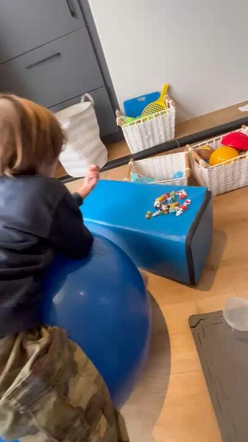

1. He lies tummy-down over a gym ball.
2. He walks forward on his hands until the ball is under his thighs.
3. He picks up a toy or puzzle piece and drops it in a bucket.
4. Walks back, collects the next one.

- **Say:** "Strong arms, straight back."
- **Easier:** Ball stays under his tummy; you hold his hips.
- **Harder:** Walk further out so the ball is under his knees; reach to the sides.
- **How much:** 5–10 items.
- **You need:** Gym ball (55 cm) or a firm ottoman

#### Tummy-time play

*Lying on elbows builds neck and shoulder strength without him noticing.*

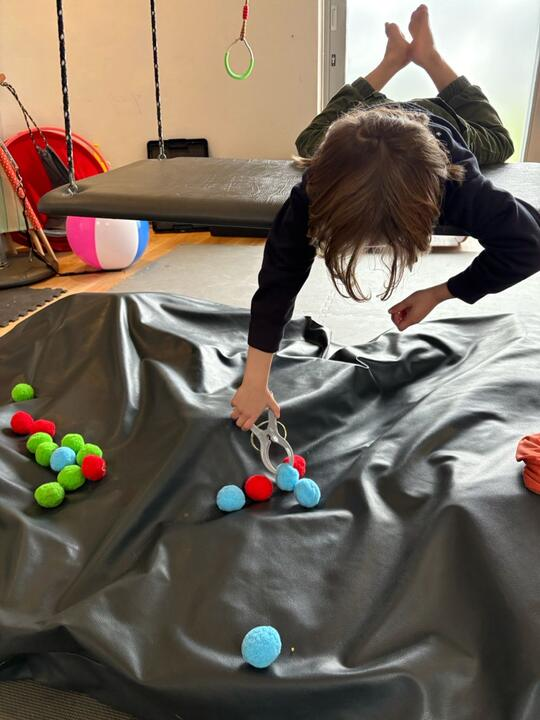

1. He lies on his tummy propped on his elbows.
2. Do a puzzle, Lego, a book or drawing on a clipboard on the floor.
3. Use this for TV or story time too.

- **Say:** "Elbows under your shoulders."
- **Easier:** Pillow under his chest.
- **Harder:** No pillow; reach out with one arm to place pieces.
- **How much:** 5–10 minutes a day.
- **You need:** Clipboard, puzzle

#### Animal walk relay

*Heavy work for arms, shoulders and core; a great warm-up before table work.*

1. Set up a start and finish line in the passage or garden.
2. Bear walk (hands and feet, bottom up), crab walk (tummy up), frog jumps, wheelbarrow.
3. Carry a beanbag or puzzle piece across each time to build a picture at the end.

- **Say:** "Big strong bear!"
- **Easier:** Short distance; wheelbarrow held at his hips or thighs.
- **Harder:** Wheelbarrow held at his knees; crab walk with a beanbag on his tummy; walk on grass or up a slope.
- **How much:** 3–4 lengths of about 5 m.
- **You need:** None (beanbag optional)

#### Heavy-work helper

*Pushing, pulling and carrying tell the body where it is, and help him feel calm and alert.*

1. Pick one job: wall push-ups, pushing a laundry basket of books, carrying the shopping, towel tug-of-war.
2. Do it for 2–3 minutes.
3. Finish with 10 wall push-ups: 'push the wall over'.

- **Say:** "Push the wall over!"
- **Easier:** Lighter loads.
- **Harder:** Heavier basket; chair push-ups (hands on seat, lift his bottom, hold 5 s).
- **How much:** 2–3 minutes before every table session.
- **You need:** Household items

#### Tall-kneeling station

*Kneeling up straight trains the hips and trunk to hold him upright.*

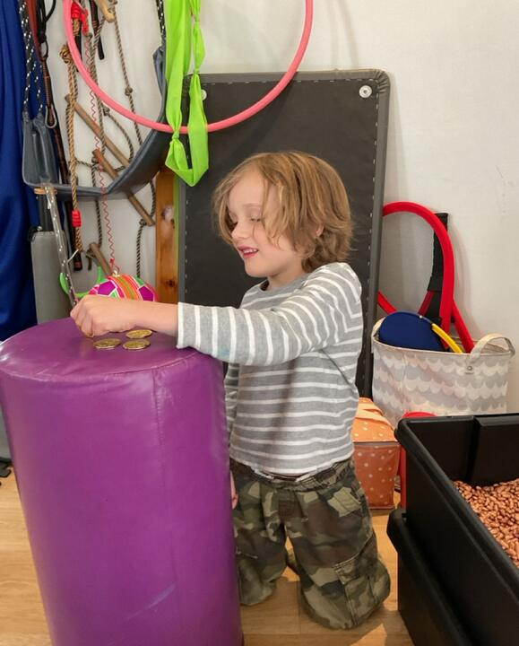

1. He kneels tall at the coffee table or sofa: hips straight, not sitting back on his heels.
2. Play a game there: post coins into a piggy bank, stickers, a puzzle.
3. Swap to half-kneeling (one knee up) halfway.

- **Say:** "Tall like a tree."
- **Easier:** Hands may rest on the sofa.
- **Harder:** Kneel on a pillow; tap a balloon with nothing to hold on to.
- **How much:** 3–5 minutes.
- **You need:** Cushion for his knees, coins and a piggy bank

#### Ball sitting and reaching

*Sitting on a moving ball makes the core work while he reaches and turns.*

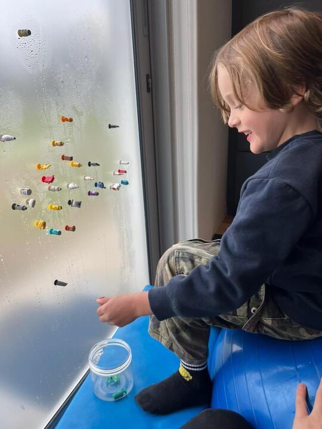

1. He sits on a gym ball, feet flat, knees bent at 90°.
2. Stick sticky notes or stickers on a window or wall at different heights and sides.
3. He reaches, peels them off and puts them in a jar.

- **Say:** "Feet flat, sit tall."
- **Easier:** You hold his hips; use a wobble cushion on a chair instead.
- **Harder:** Lift one foot; reach across his body to the far side.
- **How much:** 3–5 minutes.
- **You need:** Gym ball or wobble cushion, sticky notes

#### Obstacle course

*Combines crawling, balance, jumping and heavy work in one game he plans himself.*

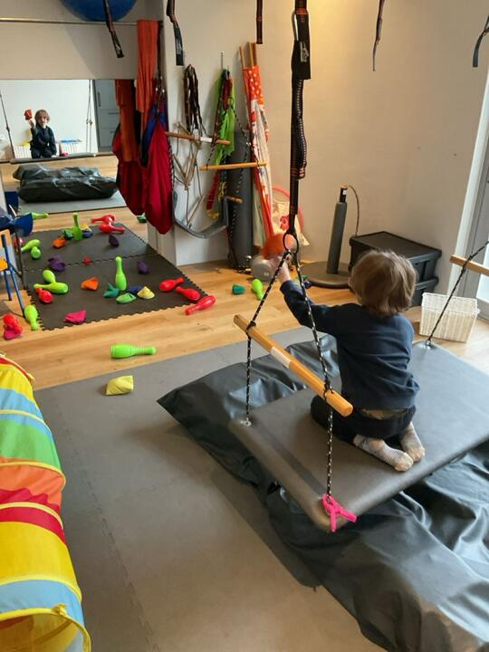

1. Build a loop: crawl under chairs, step on cushion stones, bear-walk, walk a tape line.
2. Finish with a 5-second egg hold at the end.
3. Let him redesign it for round two.

- **Say:** "Your turn to be the boss of the course."
- **Easier:** Fewer stations, more space.
- **Harder:** Carry a beanbag on his head, or add a one-leg stop.
- **How much:** 3–4 rounds.
- **You need:** Cushions, chairs, masking tape, blanket

#### Crawl and cat-cow

*Movement play the OT linked to his reflex goal. Treat it as general motor play: the research is weak.*

1. Lizard crawl: commando crawl on his tummy, head turning to the side of the bending arm.
2. On hands and knees, slowly turn his head left and right with elbows straight.
3. Cat-cow: look up and dip the back, look down and round the back. Then rock back to his heels and forward.

- **Say:** "Slow, like a sleepy cat."
- **Easier:** Short distances, 3 reps.
- **Harder:** Hold each position 5 s; lift one arm in cat-cow.
- **How much:** 3–5 minutes, 8–10 reps.
- **You need:** Rug

### Balance: standing on one leg, eyes open and closed

#### Flamingo count

*Builds the standing balance he needs. Left leg first: it is the weaker side (6 s vs 8 s).*

1. Barefoot, hands on hips, eyes on a sticker on the wall.
2. Lift one foot and count out loud together.
3. Take turns: you do it too.
4. Swap legs. Best of 3 tries.

- **Say:** "Eyes on the sticker, still as a flamingo."
- **Easier:** One fingertip on the wall.
- **Harder:** Stand on a folded towel or cushion, or catch a balloon while balancing.
- **How much:** 3–5 tries per leg.
- **You need:** Sticker on the wall

#### Sleepy flamingo (eyes closed)

*The OT goal is 10 s per leg with eyes closed. He was hesitant, so build trust step by step.*

1. Start with eyes closed on two feet for 10 s.
2. Then on one leg with your hands hovering at his hips.
3. Count out loud so he knows how long is left: 2 s, 3 s, then 5 s.
4. Step down your support: hold his hand → one finger → hands hovering → no help.

- **Say:** "Sleepy flamingo, I've got you."
- **Easier:** Look up at the ceiling instead of closing his eyes.
- **Harder:** Eyes closed for longer; later on a towel.
- **How much:** 3 tries per leg, only after a warm-up. Stand in a corner or next to the sofa.
- **You need:** Clear floor, soft surface nearby

#### Freeze dance

*Balance practice that feels like a party.*

1. Play music and dance.
2. When the music stops he freezes: two feet → tiptoes → one leg.
3. Call out which leg: 'left flamingo!'

- **Say:** "Freeze! Left leg up!"
- **Easier:** Freeze on two feet.
- **Harder:** Freeze on one leg with eyes closed.
- **How much:** 5 minutes.
- **You need:** Music

#### Tightrope walk

*Balance while moving, plus body awareness of where his feet are.*

1. Put a 2–3 m line of masking tape on the floor (or a plank).
2. Walk forwards heel-to-toe, then backwards, then sideways.
3. Stop halfway and stand on one leg.

- **Say:** "Heel touches toe."
- **Easier:** Wide tape, normal steps.
- **Harder:** Beanbag on his head, step over toys on the line, or use a plank.
- **How much:** 5–10 lengths.
- **You need:** Masking tape or a plank

#### Floor is lava

*Jumping and landing on small targets trains balance and control.*

1. Lay cushions or paper plates as stepping stones.
2. He steps or jumps across without touching the 'lava'.
3. Add a hop between some stones.

- **Say:** "Land like a cat, quiet feet."
- **Easier:** Stones close together and firm.
- **Harder:** Bigger gaps, soft cushions, hop on one foot.
- **How much:** 3–5 rounds.
- **You need:** Cushions or paper plates

#### Hop count and sock challenge

*Hopping and dressing on one leg are everyday balance tests.*

1. Hop on one foot, counting: 5 hops, then 10. Each foot.
2. Put on socks and shoes standing up.

- **Say:** "Bounce, bounce, bounce!"
- **Easier:** Lean on the wall to dress.
- **Harder:** Hop forwards and backwards over a line.
- **How much:** Daily when dressing.
- **You need:** None

### Two hands: both sides working together, crossing the middle

#### Hopscotch

*The OT's next bilateral goal after star jumps.*

1. Step 1: on the spot, jump feet together and apart to a rhythm: 'close, open'.
2. Step 2: chalk or tape a grid of single and double squares.
3. Step 3: the full game, hopping in singles and landing open in doubles.

- **Say:** "Close, open, close, open!"
- **Easier:** Two-foot jumps only; you jump beside him.
- **Harder:** Pick up a stone while on one leg; go faster.
- **How much:** 3–5 rounds.
- **You need:** Chalk or masking tape

#### Star jumps

*He can do 10 now. Keep it smooth and steady, then add arms.*

1. 10 star jumps with legs only to a count.
2. Then add arms in time with the legs.
3. Try to music.

- **Say:** "Out, in, out, in."
- **Easier:** Arms only, then legs only.
- **Harder:** Cross jacks (legs cross in front), or 3 sets of 10.
- **How much:** 3 × 5–10.
- **You need:** None

#### Cross-crawl march

*Hand to opposite knee gets both sides of the body talking across the middle.*

1. March on the spot, touching right hand to left knee, left hand to right knee.
2. Then elbow to opposite knee.
3. Then hand to opposite foot behind his back.

- **Say:** "Hand to the other knee."
- **Easier:** Go slowly; you mirror him.
- **Harder:** Faster, to a song.
- **How much:** 1–2 minutes (10–20 touches).
- **You need:** Music

#### Cross-over sticker hunt

*Reaching across his body and turning his trunk: what the OT asked for.*

1. He sits cross-legged or kneels tall.
2. Put stickers on his right arm and leg, or toys on his right side.
3. He collects them with his LEFT hand and sticks them on a board on his left side.

- **Say:** "Left hand goes on a trip."
- **Easier:** Items close to his body.
- **Harder:** Items further away and behind him; you pass items from behind his back.
- **How much:** 10–20 items.
- **You need:** Stickers, small toys

#### Lazy-8 racetrack

*A sideways 8 crosses the middle every lap and trains smooth pencil control.*

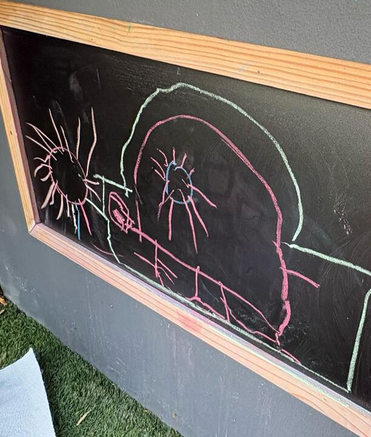

1. Draw a big sideways 8 on paper taped to the wall, a chalkboard or a window, centred in front of him.
2. He drives a toy car round it, then traces with chalk or crayon.
3. Left hand, right hand, then both hands together.

- **Say:** "Stay on the road."
- **Easier:** Trace over a thick line.
- **Harder:** Draw it freely; make it smaller.
- **How much:** 5–10 laps.
- **You need:** Chalk, crayon, toy car

#### Ball pass and twist

*Trunk rotation, the second half of the OT's midline advice.*

1. Pass a ball around his waist, over his head and under his legs.
2. Sit back to back with him and pass the ball to the side, twisting.
3. Windmills: feet apart, touch hand to opposite foot.

- **Say:** "Twist and pass."
- **Easier:** Big ball, slow.
- **Harder:** Smaller ball, faster, count passes.
- **How much:** 10 passes each way.
- **You need:** Ball

#### Balloon tennis

*Eye-hand coordination and taking turns between hands.*

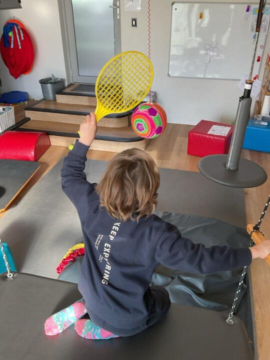

1. Keep a balloon in the air with a racquet or paper-plate paddle.
2. Then strictly alternate hands.
3. Try it kneeling.

- **Say:** "Left, right, left!"
- **Easier:** Any hand, any time.
- **Harder:** Two hands on a pool noodle; count hits.
- **How much:** 2–3 minutes.
- **You need:** Balloon, kids' racquet or paper plate

#### Beanbag target throw

*Aiming and throwing across his body.*

1. Set up skittles, bottles or a bucket.
2. He kneels and throws beanbags at the targets.
3. Alternate hands; throw across his body.

- **Say:** "Look, aim, throw."
- **Easier:** Closer and bigger targets.
- **Harder:** Further away; throw while standing on one leg.
- **How much:** 10 throws.
- **You need:** Beanbags, skittles or bottles

#### Scooter board

*Both arms working together while the core holds him up.*

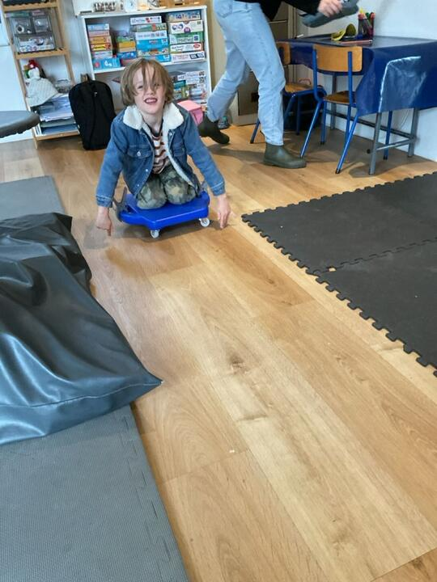

1. He sits or lies on his tummy on the scooter board.
2. Pushes with both hands to collect beanbags across the room.
3. Or pulls himself along a rope tied to a table leg.

- **Say:** "Both hands push together."
- **Easier:** Sitting, short distance.
- **Harder:** Lying on his tummy; pulling hand over hand.
- **How much:** 5 minutes.
- **You need:** Scooter board (nice-to-have)

#### Two-hand kitchen jobs

*Real jobs where one hand holds and the other works.*

1. Roll dough with a rolling pin.
2. Pour from a jug into a cup he holds.
3. Stir while holding the bowl; spread butter while holding the bread; open jars.

- **Say:** "Helper hand holds, busy hand works."
- **Easier:** Small amounts, big cups.
- **Harder:** Pour to a line; open tight lids.
- **How much:** Any day.
- **You need:** Kitchen

### Strong hands: finger strength and staying power

#### Playdough gym

*Strengthens the small muscles in the hand, so colouring lasts longer.*

1. Roll tiny balls between thumb, pointer and middle fingertips.
2. Roll snakes, pinch pots, poke holes with each finger.
3. Hide beads or coins inside and dig them out.
4. Snip the snakes with his scissors.

- **Say:** "Use your fingertips."
- **Easier:** Soft dough.
- **Harder:** Firmer dough or therapy putty; smaller beads.
- **How much:** 3–5 minutes.
- **You need:** Play-Doh or therapy putty, beads

#### Peg it on

*Pinching pegs builds the thumb–finger pinch used for a pencil.*

1. Clip pegs onto a paper plate, box rim or card.
2. Match colours or numbers.
3. Use thumb and pointer finger, then thumb and middle finger.

- **Say:** "Pinch with your pointer and thumb."
- **Easier:** Loose pegs.
- **Harder:** Stiff pegs; pick up pompoms with a peg.
- **How much:** 10–20 pegs.
- **You need:** Wooden pegs

#### Tongs and tweezer transfer

*Squeezing tweezers builds pinch strength; holding them like a pencil practises the grip.*

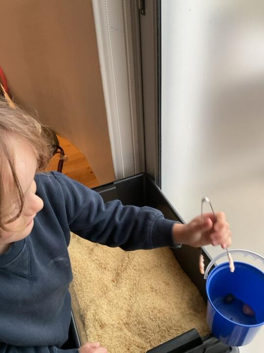

1. Fill a tray with rice or beans and hide pompoms or marbles.
2. He picks them out with tongs or tweezers and drops them in a bucket or ice-cube tray.
3. Hold the tweezers like a pencil.

- **Say:** "Hold them like your crayon."
- **Easier:** Big tongs, big pompoms.
- **Harder:** Small tweezers, beans or cereal; beat a 1-minute timer.
- **How much:** 2–3 minutes.
- **You need:** Tongs or tweezers, rice tray, pompoms

#### Geoboard patterns

*Stretching bands strengthens fingers; copying patterns trains seeing shapes.*

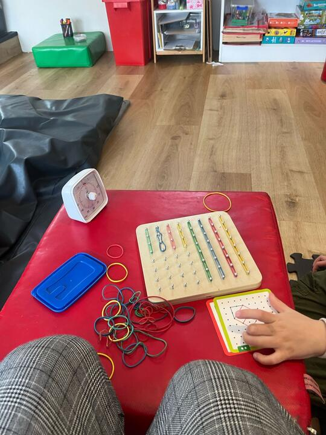

1. Put rubber bands on the geoboard pegs.
2. Copy a pattern card.
3. Make his own shape for you to copy.

- **Say:** "Stretch and hook."
- **Easier:** Free designs with big bands.
- **Harder:** Copy harder cards; small bands.
- **How much:** 5 minutes.
- **You need:** Geoboard and bands

#### Spray-bottle jobs

*Squeezing a trigger builds strength in the pointer and middle fingers.*

1. Water the plants, spray chalk drawings off the paving, or knock ping-pong balls off a ledge.
2. Use two fingers on the trigger.

- **Say:** "Two fingers squeeze."
- **Easier:** Big trigger, whole hand.
- **Harder:** Small trigger, small targets.
- **How much:** 2–3 minutes.
- **You need:** Spray bottle

#### Punch and lace

*Hole punching builds strength; lacing gets two hands working together.*

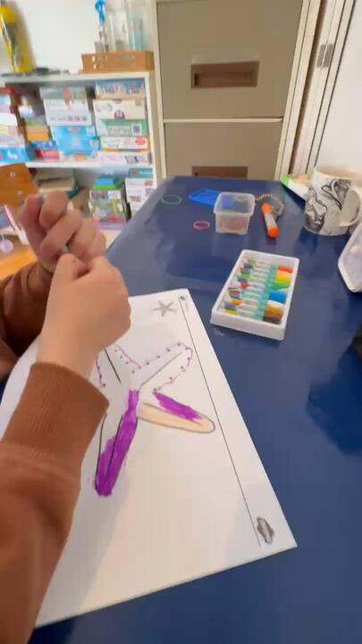

1. Punch holes around a paper plate or a coloured picture.
2. Lace wool or a shoelace through the holes.
3. Or thread beads on a lace or pipe cleaner.

- **Say:** "In and out, like sewing."
- **Easier:** Big beads on a pipe cleaner.
- **Harder:** Small beads; follow a colour pattern.
- **How much:** 5 minutes.
- **You need:** Hole punch, laces, beads

#### Squirrel stash (coins)

*Moving coins from palm to fingertips in one hand: a key skill for handling a pencil.*

1. He picks up coins one at a time and hides them in his left palm.
2. Then feeds them one by one into a piggy bank, using only that hand.
3. Flip a coin over with fingertips, then post it.

- **Say:** "Squirrel hides the nuts."
- **Easier:** Two big buttons.
- **Harder:** 5 or more small coins.
- **How much:** 3 rounds.
- **You need:** Coins, piggy bank

#### Hammer and golf tees

*Helper hand holds, busy hand taps: strength and two-hand teamwork.*

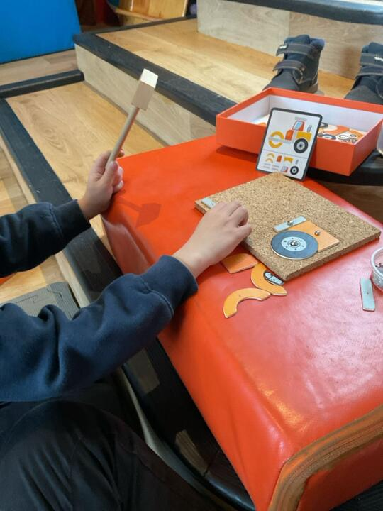

1. Push golf tees into a polystyrene block, cardboard box or thick playdough.
2. Tap them in with a toy hammer.
3. Or use a tap-tap shapes kit.

- **Say:** "Hold with your fingertips, tap gently."
- **Easier:** Tees pre-started.
- **Harder:** Pull them out with his fingertips; make a pattern.
- **How much:** 5 minutes.
- **You need:** Golf tees, toy hammer, polystyrene

#### Sensory treasure hunt

*Finding small things in foam, rice or beans uses fingertips and finger isolation.*

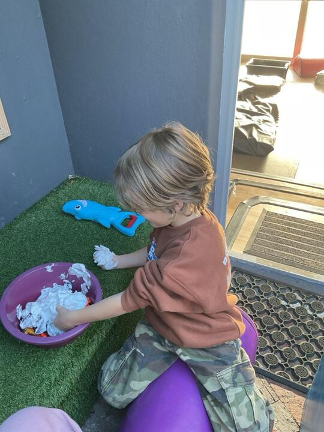

1. Hide small toys in shaving foam, rice or dry beans.
2. He finds them with his fingers only.
3. Sort them into an ice-cube tray.

- **Say:** "Detective fingers."
- **Easier:** Bigger toys.
- **Harder:** Tiny items; use tweezers.
- **How much:** 5 minutes.
- **You need:** Shaving foam, rice or beans, small toys

#### Tear and stick collage

*Tearing small pieces uses both hands and the fingertip pinch.*

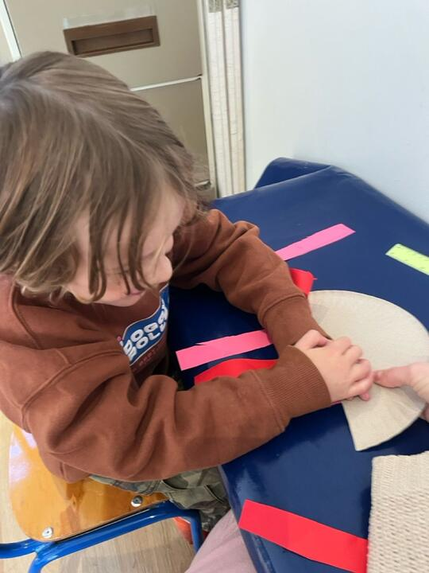

1. Tear coloured paper into strips, then small pieces.
2. Glue them inside an outline to make a picture.
3. Peel and stick stickers too.

- **Say:** "Thumbs on top, tear small."
- **Easier:** Thin paper, big pieces.
- **Harder:** Card; tiny pieces; small outline.
- **How much:** 5–10 minutes.
- **You need:** Coloured paper, glue stick, stickers

### Scissors: thumbs up, helper hand turns the paper

#### Snip snip

*Short, single snips build the open-shut action and confidence.*

1. Snip playdough snakes into pieces.
2. Snip straws into 'beads' to thread later.
3. Snip card strips 2 cm wide into confetti.

- **Say:** "Thumbs up! Open, shut."
- **Easier:** Playdough, then straws.
- **Harder:** Wider strips that need two snips.
- **How much:** 20 snips.
- **You need:** Left-handed scissors, playdough, straws, card

#### Road cutting

*Straight lines first, with the thumb up and the helper hand holding.*

1. Draw a thick 1 cm 'road' on card.
2. He cuts down the middle of the road.
3. Helper hand holds the card at the edge, thumb on top.
4. Progress: 10 cm long → across an A4 page; thick → thin lines.

- **Say:** "Thumbs up, stay on the road."
- **Easier:** Card instead of paper; shorter roads.
- **Harder:** Thinner lines, ordinary paper, longer lines.
- **How much:** 3–5 lines.
- **You need:** Left-handed scissors, card, thick marker

#### Curvy roads

*Curves are his next step. The helper hand must turn the paper, not his shoulder.*

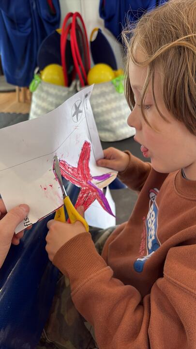

1. Draw gentle waves, then zigzag mountains, then a big circle.
2. His scissor hand stays thumbs-up with the elbow at his side.
3. His helper hand (right) turns the paper as he goes.
4. Lefties cut circles clockwise: draw arrows to show the way.

- **Say:** "Helper hand turns the paper."
- **Easier:** Wide curves on card.
- **Harder:** Tighter curves, smaller circles, thin paper.
- **How much:** 3–5 lines.
- **You need:** Left-handed scissors, card

#### Cut and make

*Cutting with a purpose: a picture or craft to keep.*

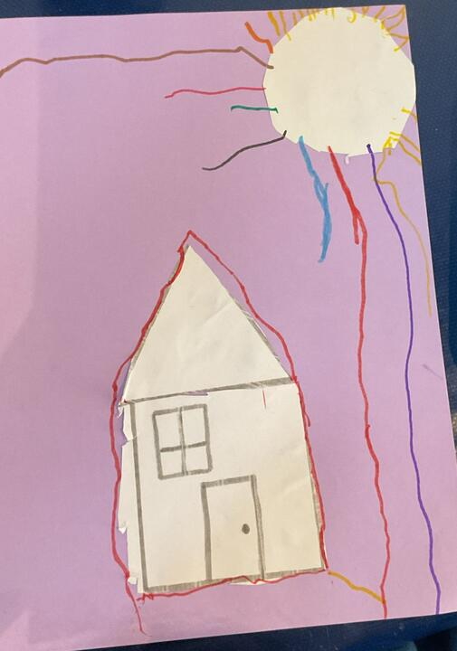

1. Cut a big square, triangle and circle from card.
2. Glue them into a picture: house, rocket, robot.
3. Later: cut pictures out of catalogues or colouring sheets.

- **Say:** "Turn the paper, not your body."
- **Easier:** Bigger shapes, wide border.
- **Harder:** Smaller shapes, cut right on the line.
- **How much:** 1 craft.
- **You need:** Left-handed scissors, card, glue

### Pencil: grip, control, colouring and shapes

#### Dot-to-dot

*The OT's top tip for getting him keen to draw. Moving point to point builds pencil control.*

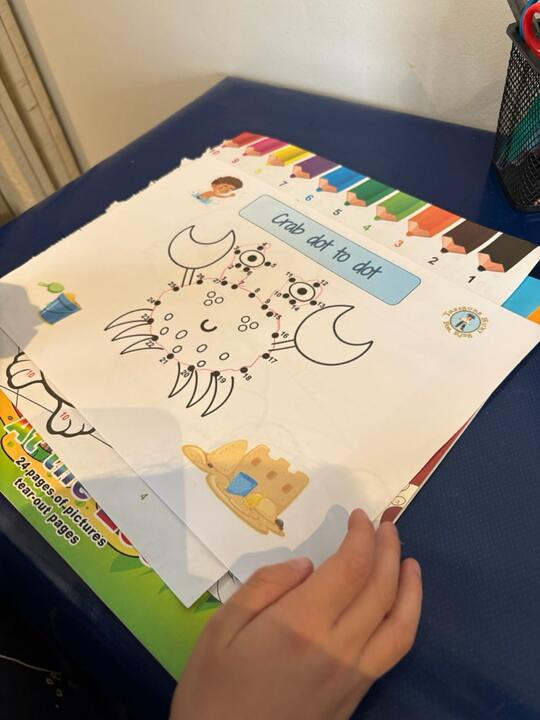

1. Start with a 1–10 dot-to-dot with big dots.
2. Or draw a simple picture in dots for him (a house, a car, a fish).
3. He joins them, then colours it in.

- **Say:** "Pinch the tip, go dot to dot."
- **Easier:** Fewer dots, close together.
- **Harder:** 1–20, then 1–50; smaller dots.
- **How much:** 1–2 sheets.
- **You need:** Dot-to-dot book, short crayon or pencil

#### Mazes and rainbow tracing

*Stopping and steering inside a path is pencil control.*

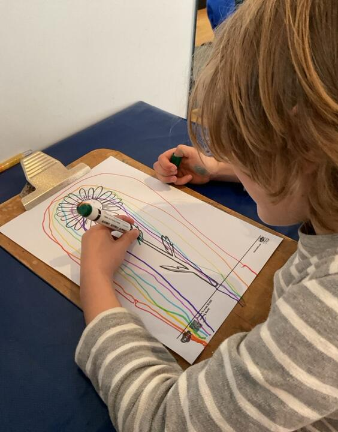

1. Wide mazes first: drive a toy car through, then trace with a crayon.
2. Rainbow trace: go over the same line 3–5 times in different colours.
3. Line-matching puzzles (like the OT's 'focus challenge').

- **Say:** "Slow car, stay inside."
- **Easier:** 2 cm wide paths.
- **Harder:** 5 mm paths, longer mazes.
- **How much:** 1–3 mazes.
- **You need:** Maze book, crayons

#### Draw on the wall

*Drawing on an upright surface bends the wrist back and strengthens the shoulder: both help the grip.*

1. Tape paper to the wall or fridge at eye level, or use a chalkboard, easel or window markers.
2. Big shapes, lazy-8s, roads and houses.
3. Then smaller shapes inside a boundary.

- **Say:** "Stand tall, small chalk."
- **Easier:** Big strokes, big chalk.
- **Harder:** Small chalk pieces; colour inside shapes.
- **How much:** 5 minutes.
- **You need:** Chalkboard or easel, chalk, tape

#### Small-picture colouring

*Small pictures build finger stamina with a quick win. OT advice.*

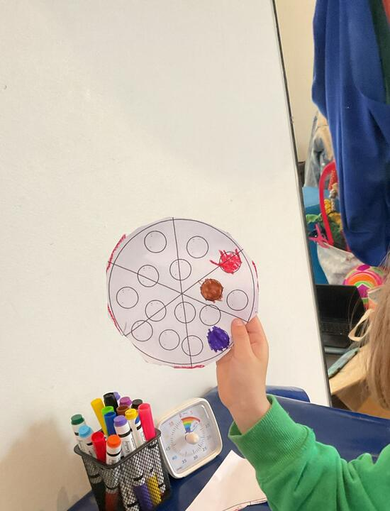

1. Choose a picture about the size of a playing card, with thick outlines.
2. Set the visual timer: 3 minutes, then build to 5 and 8.
3. Use broken crayons under 3 cm long.
4. If he swaps hands, say calmly 'left hand draws, right hand helps' and hand the crayon back. If he swaps again within a minute, he is tired: stop and move.
5. Put the crayon pot on his right so he reaches across his body.

- **Say:** "Shake, squeeze, same hand."
- **Easier:** Raised outline (dried glue or a playdough snake) he can feel.
- **Harder:** Smaller areas, mandalas, colour-by-number.
- **How much:** Start at a length he manages without swapping (2–3 minutes). Add 1 minute after 3 good sessions.
- **You need:** Small colouring pictures, short crayons, visual timer

#### Paint and dot

*A brush or cotton bud needs a fingertip grip and a light touch.*

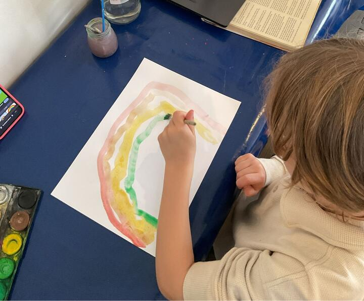

1. Paint rainbow arcs with watercolours.
2. Dot-paint with cotton buds inside circles.
3. Hold the brush low, near the bristles.

- **Say:** "Pinch near the bristles."
- **Easier:** Thick brush, big paper.
- **Harder:** Thin brush, stay inside lines.
- **How much:** 5–10 minutes.
- **You need:** Watercolours, cotton buds

#### How-to-draw videos

*The OT recommends these to make drawing fun. Step-by-step drawing practises shapes and control.*

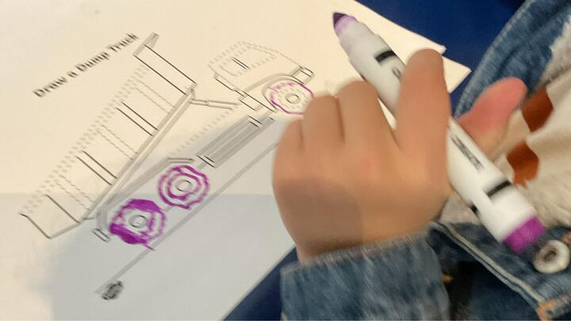

1. Choose a short video, e.g. Art for Kids Hub on YouTube.
2. Pause after each step so he can finish it.
3. Draw alongside him.

- **Say:** "Pause, draw, play."
- **Easier:** Very simple animals and vehicles.
- **Harder:** More detailed drawings, then colour them.
- **How much:** 1 drawing, 10–15 minutes.
- **You need:** Tablet or laptop, paper, short pencil

#### Shape of the week

*Copying shapes is the OT's visual-motor goal (he was at about a 4-year level).*

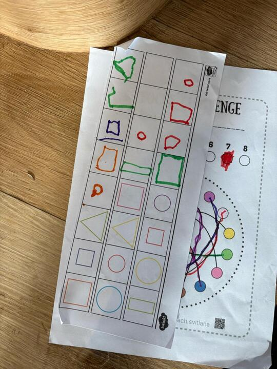

1. Order: + → square → / and \ → X → triangle. Say the strokes: square is 'down, across, down, across'.
2. Make it big first: finger in shaving foam, chalk on the wall, sticks on the floor.
3. Then on paper: you draw it, he copies next to yours (copy, don't trace).
4. Turn it into a picture: a square becomes a house.

- **Say:** "Start at the top."
- **Easier:** Watch you draw it, then copy straight away.
- **Harder:** Copy from a finished picture; combine shapes into a robot.
- **How much:** 5 shapes.
- **You need:** Paper, sticks, chalk

#### Stencils

*The helper hand holds the stencil firmly while the busy hand traces.*

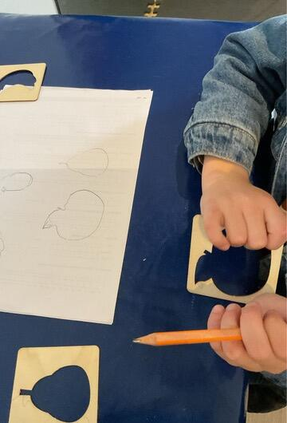

1. Helper hand presses the stencil flat.
2. He traces inside the shape with a short pencil.
3. Colour it in.

- **Say:** "Helper hand holds it still."
- **Easier:** Big simple stencils.
- **Harder:** Small or detailed stencils.
- **How much:** 3–4 shapes.
- **You need:** Stencils, short pencil

## 11. When to stop

**Tired signs:**

- Propping his head on his hand or lying on the table
- Slumping, wriggling off the chair, kneeling on the chair
- Switching the crayon to the other hand
- Grip gets tighter, lines get wobbly, presses very hard or very light
- Rushing, scribbling, silliness or tears

Switch to a movement break, then finish with something easy he enjoys. Never push through tears.

**Safety:** balance work barefoot, clear floor, next to a sofa, your hands hovering at his hips; stay within reach on the gym ball; wheelbarrow held at thighs or knees; count out loud during holds so he keeps breathing.

**Tell Roland's parents (they'll check with the OT):**

- Any pain, dizziness or a fall during an exercise
- He refuses or gets very upset for several sessions in a row
- No progress on a goal after about 4 weeks of regular practice
- Before buying a pencil grip or special pencil: the OT said one may help in Grade R and should be monitored
- Before trying to sort out his handwriting letters: shapes come first at this age

## 12. Logging and progress

- After every session: date, minutes, activities, mood, focus, grip reminders, hand swapping, what went well, what was hard. Use the Log tab in the app (or the paper sheet in `print/Roland-Log-Sheets.pdf`), and send it on WhatsApp.
- Check-in on Friday of weeks 1, 3, 5, 7, 9: balance (each leg, eyes open and closed, best of 3), egg and superman holds, minutes sitting upright, minutes colouring, hand swaps in 5 minutes of colouring, six skill ratings (Not yet / With help / Mostly / Easily), and which shapes he copies.
- Week 5: send the check-in to Simóne for a quick review. Week 9: send the final check-in and ask about restarting therapy before Grade R.
